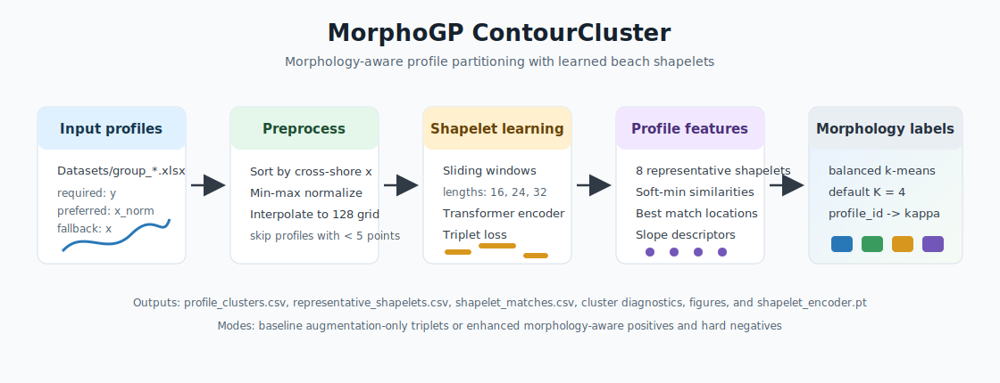

# MorphoGP

MorphoGP is a research codebase for morphology-aware coastal profile analysis.
The current implementation focuses on **ContourCluster**, the morphology
classification stage used to partition cross-shore beach profiles into
interpretable profile regimes before downstream category-specific modelling.



## Overview

ContourCluster does not directly predict beach elevation. It learns local
profile fragments, called **beach shapelets**, and uses their profile-level
matching patterns to assign each surveyed profile to a morphology category
`kappa`. These categories are intended to support later MorphoGP experts by
avoiding a single global model over geometrically different beach states.

The implemented pipeline:

1. Loads Excel profile files from `Datasets/group_*.xlsx`.
2. Interpolates each profile onto a normalized cross-shore grid.
3. Extracts multi-scale local shapelet candidates.
4. Trains a Transformer shapelet encoder with triplet loss.
5. Clusters candidate embeddings and selects representative shapelets.
6. Matches representative shapelets back to full profiles.
7. Builds profile-level features from shapelet similarities, match locations,
   and slope descriptors.
8. Clusters profiles with `kmeans` or capacity-constrained `balanced_kmeans`.

## Repository Layout

```text
MorphoGP/
├── morphogp/
│   ├── __init__.py
│   └── contourcluster.py          # ContourCluster implementation and Python API
├── script/
│   ├── run_contourcluster.py      # CLI entry point and plotting utilities
│   └── data_split.py              # Reserved for data split utilities
├── benchmark/                     # Experimental baseline model stubs
├── config/                        # Experimental benchmark config files
├── docs/
│   └── morphogp_pipeline.svg      # Pipeline diagram used in this README
├── paper/                         # Method/result text fragments for the paper
├── results/                       # Local experiment outputs, ignored by Git
├── cluster_result/                # Local split/cluster files, ignored by Git
└── Datasets/                      # Local raw Excel profiles, ignored by Git
```

`results/`, `cluster_result/`, and `Datasets/` are intentionally ignored so raw
data, generated figures, model checkpoints, and large intermediate files are
not uploaded accidentally.

## Installation

Use Python 3.10 or newer. The project currently does not ship a pinned
`requirements.txt`, so install the runtime dependencies directly:

```bash
python -m venv .venv
source .venv/bin/activate
python -m pip install --upgrade pip
python -m pip install numpy pandas scipy scikit-learn torch matplotlib openpyxl tabulate pyyaml
```

Run all commands from the repository root. The CLI entry point adds the
repository root to `PYTHONPATH` automatically.

## Data Format

Place input profiles under `Datasets/` as one Excel workbook per profile:

```text
Datasets/
├── group_1.xlsx
├── group_2.xlsx
└── ...
```

Each workbook must contain:

| Column | Required | Description |
| --- | --- | --- |
| `y` | yes | Profile elevation values. |
| `x_norm` | preferred | Normalized cross-shore coordinate. |
| `x` | fallback | Raw cross-shore coordinate, used when `x_norm` is absent. |

Rows with non-finite `x`/`y` values are removed. Profiles are sorted by
cross-shore coordinate, the coordinate is min-max normalized to `[0, 1]`, and
the elevation is linearly interpolated to a fixed grid. Profiles with fewer
than `min_profile_points` valid points are skipped and reported in
`skipped_profiles.csv`.

## Quick Start

Run the main ContourCluster experiment with the paper-style balanced
four-regime setting:

```bash
python script/run_contourcluster.py \
  --data-dir Datasets \
  --output-dir results/contourcluster/balanced_k4_baseline \
  --mode baseline \
  --profile-k 4
```

Run the morphology-aware triplet sampling variant:

```bash
python script/run_contourcluster.py \
  --data-dir Datasets \
  --output-dir results/contourcluster/balanced_k4_enhanced \
  --mode enhanced \
  --profile-k 4
```

Run a small CPU smoke test:

```bash
python script/run_contourcluster.py \
  --data-dir Datasets \
  --output-dir /tmp/morphogp-smoke \
  --limit 5 \
  --epochs 1 \
  --steps-per-epoch 1 \
  --batch-size 16 \
  --profile-k 2 \
  --n-shapelets 2 \
  --device cpu
```

Use `--device cuda` when a compatible PyTorch/CUDA environment is available.

## CLI Arguments

`script/run_contourcluster.py` exposes the most important experiment controls:

| Argument | Default | Description |
| --- | ---: | --- |
| `--data-dir` | `Datasets` | Directory containing `group_*.xlsx` profile files. |
| `--output-dir` | `results/contourcluster` | Directory for CSV, figure, summary, and checkpoint outputs. |
| `--mode` | `baseline` | Triplet sampling strategy: `baseline` or `enhanced`. |
| `--limit` | `None` | Optional cap on loaded valid profiles, useful for smoke tests. |
| `--epochs` | `6` | Shapelet encoder training epochs for the CLI. |
| `--steps-per-epoch` | `60` | Triplet batches per epoch for the CLI. |
| `--batch-size` | `256` | Triplet batch size. |
| `--n-shapelets` | `8` | Number of representative shapelet clusters. |
| `--profile-length` | `128` | Number of grid points after profile interpolation. |
| `--d-model` | `32` | Transformer hidden width for the CLI. |
| `--embedding-dim` | `24` | Shapelet embedding dimension for the CLI. |
| `--profile-k` | `4` | Number of profile morphology clusters; use `0` for automatic selection. |
| `--profile-clustering` | `balanced_kmeans` | Profile clustering backend: `kmeans` or `balanced_kmeans`. |
| `--min-cluster-fraction` | `0.08` | Minimum cluster-size fraction used during automatic `K` selection. |
| `--device` | `cuda` if available, else `cpu` | PyTorch training device. |

## ContourCluster Hyperparameters

The library defaults live in `morphogp.contourcluster.ContourClusterConfig`.

| Hyperparameter | Library default | Meaning |
| --- | ---: | --- |
| `profile_length` | `128` | Fixed grid length for each normalized profile. |
| `candidate_lengths` | `(16, 24, 32)` | Sliding-window lengths for local shapelet candidates. |
| `shapelet_points` | `32` | Fixed length after resampling each candidate fragment. |
| `min_profile_points` | `5` | Minimum valid survey points required to keep a profile. |
| `n_shapelets` | `8` | Number of shapelet embedding clusters and representatives. |
| `k_range` | `(2, 3, 4, 5, 6, 7, 8)` | Candidate profile-cluster counts for diagnostics or auto-selection. |
| `gamma` | `3.0` | Soft-min sharpness for shapelet-to-profile matching. |
| `d_model` | `48` | Transformer encoder hidden width in the Python API default. |
| `nhead` | `4` | Number of Transformer attention heads. |
| `num_layers` | `2` | Number of Transformer encoder layers. |
| `embedding_dim` | `32` | Output embedding size in the Python API default. |
| `margin` | `0.30` | Triplet loss margin. |
| `batch_size` | `256` | Number of triplets per optimization step. |
| `epochs` | `8` | Python API default number of training epochs. |
| `steps_per_epoch` | `80` | Python API default triplet batches per epoch. |
| `learning_rate` | `1e-3` | AdamW learning rate. |
| `neighbor_pool` | `12` | Positive/hard-negative neighbor pool size in `enhanced` mode. |
| `profile_k` | `4` | Requested number of morphology clusters; `None` enables auto-selection. |
| `profile_clustering` | `balanced_kmeans` | Profile clustering algorithm. |
| `min_cluster_fraction` | `0.08` | Minimum profile-cluster fraction for automatic `K` selection. |
| `balanced_kmeans_max_iter` | `30` | Maximum iterations for balanced k-means assignment. |
| `random_state` | `42` | Reproducibility seed for NumPy, PyTorch, and clustering. |

The CLI intentionally uses lighter defaults than the direct Python API for
routine runs: `epochs=6`, `steps_per_epoch=60`, `d_model=32`, and
`embedding_dim=24`. If you instantiate `ContourClusterConfig()` directly, the
library defaults in the table above are used instead.

## Outputs

Each run writes the following files under `--output-dir`:

| File | Description |
| --- | --- |
| `profile_clusters.csv` | Final `profile_id -> kappa` morphology labels. |
| `profile_cluster_summary.csv` | Cluster-level summaries and representative profiles. |
| `profile_cluster_metrics.csv` | Silhouette, compactness, balance, and size diagnostics for tested `K`. |
| `representative_shapelets.csv` | Geometry descriptors and source profiles for representative shapelets. |
| `shapelet_matches.csv` | Best match location, distance, and similarity for each profile/shapelet pair. |
| `candidate_shapelet_clusters.csv` | Shapelet-cluster assignment for every candidate fragment. |
| `candidate_embedding_pca.csv` | Two-dimensional PCA projection of shapelet embeddings. |
| `skipped_profiles.csv` | Profiles skipped because of missing columns or too few valid points. |
| `training_summary.csv` | Triplet-loss and selected profile-clustering metadata. |
| `shapelet_encoder.pt` | PyTorch state dict for the trained shapelet encoder. |
| `fig_shapelet_interpretation.png/.pdf` | Representative shapelets overlaid on best-matching profile segments. |
| `fig_profile_clusters.png/.pdf` | Cluster profile envelopes and mean profile curves. |
| `fig_embedding_umap_or_pca.png/.pdf` | PCA visualization of candidate shapelet embeddings. |
| `run_summary.md` | Human-readable run summary and `K` diagnostics. |

## Python API

```python
from morphogp import ContourClusterConfig, run_contourcluster

config = ContourClusterConfig(
    profile_length=128,
    n_shapelets=8,
    profile_k=4,
    profile_clustering="balanced_kmeans",
)

result = run_contourcluster(
    data_dir="Datasets",
    output_dir="results/contourcluster/api_run",
    config=config,
    mode="baseline",
    device="cpu",
)

profile_labels = result["profile_labels"]
selected_k = result["selected_k"]
```

Use `mode="enhanced"` to enable morphology-aware positives and hard negatives
based on local slope, curvature, position, and normalized shape descriptors.

## Benchmark Status

The `benchmark/` and `config/` directories contain experimental baseline-model
entry points for linear regression, random forest, polynomial regression, SVR,
KNN, MLP, and Transformer regressors. They are not yet a complete reproducible
benchmark suite: the shared training templates are currently empty and most
YAML configuration files are placeholders. Treat this part of the repository as
work in progress unless those templates and configs are completed.

## Reproducibility Notes

- `random_state=42` is used by default for NumPy sampling, PyTorch seeding, and
  clustering components.
- CPU/GPU differences can still lead to small numerical differences in the
  learned embeddings and downstream cluster labels.
- Raw datasets are not tracked by Git. To reproduce the paper experiments, use
  the same `Datasets/group_*.xlsx` profile collection and the CLI settings
  reported above.
- The balanced `K=4` configuration is the main morphology-regime setting. `K=3`
  and `K=5` can be used as sensitivity analyses by changing `--profile-k`.

## Citation

If this repository supports your work, cite the associated MorphoGP manuscript.
The BibTeX entry will be added after publication.

```bibtex
@misc{morphogp,
  title  = {MorphoGP: Morphology-Aware Gaussian Process Modelling for Coastal Profiles},
  author = {Wu, Xi},
  year   = {2025},
  note   = {Research code}
}
```

## License

This project is released under the MIT License. See [LICENSE](LICENSE) for
details.
